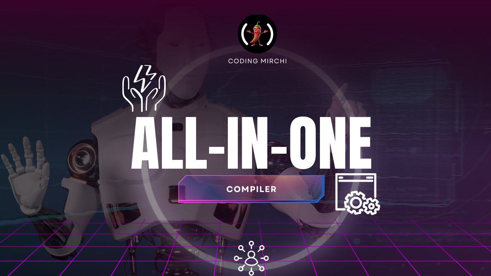

# 🖥 All-in-One Compiler



🚀 A web-based compiler and coding practice platform that brings together everything you need to learn and practice coding — all in one place. 

Unlike basic compilers, this project not only supports multiple programming languages but also comes with advanced features such as coding question generation, database storage, progress tracking, and a personalized dashboard. 

It’s more than just a compiler — it’s a complete coding assistant designed to make coding accessible, interactive, and effective. 

---

## ✨ Features

### 🖊 Compiler (All Standard Features)
- Supports multiple languages: C, C++, Java, Python, JavaScript, and more. 
- Syntax highlighting and editor-like environment. 
- Custom input support (stdin). 
- Real-time output display for code execution. 
- Error handling with clear compiler/runtime error messages. 
- Multiple test cases support (run code against hidden/public test cases). 
- Fast and lightweight execution directly in your browser. 

### 📚 Coding Question Generator
- Automatically generates unique coding questions for practice. 
- Questions are stored in the database only if they don’t already exist (avoiding duplicates). 
- Categorized by difficulty levels: Easy, Medium, Hard. 
- Covers a wide range of topics: arrays, strings, recursion, dynamic programming, etc. 

### 📊 Progress Tracking & Dashboard
- Track your journey: number of questions solved, attempted, and skipped. 
- Performance metrics: accuracy, success rate, coding streaks. 
- Visual dashboard with charts and analytics. 
- Helps users identify weak areas and improve gradually. 

### 🧪 Test Case Evaluation
- Submissions are validated against multiple test cases. 
- Instant feedback on correctness, runtime, and efficiency. 
- Encourages writing clean and optimized code. 

### 🌍 Accessibility
- Runs directly in the browser — no heavy IDE or setup required. 
- Works on all major operating systems and devices. 
- Lightweight, responsive, and user-friendly UI. 

### 🤝 Open-source & Community-driven
- Built for learners, by learners. 
- Community contributions are welcome. 

---

## 🛠️ Installation & Setup
Follow these instructions to get the project running on your local machine.

### 1) Clone the Repository
First, clone the project repository to your local machine.

```bash
git clone https://github.com/akash-kant/CM_Coding_Platform.git
cd CM_Coding_Platform
```

### 2) Server Setup (Backend)
Follow these steps to set up and run the backend server.

#### Steps
1. Navigate to the server directory:
   ```bash
   cd server
   ```
2. Install dependencies:
   ```bash
   npm install
   ```
3. Create a `.env` file in the `server` directory with the following variables:
   ```bash
   # Server Configuration
   PORT=5000
   # MongoDB Connection String
   # Replace with your actual MongoDB connection URI
   MONGO_URI=mongodb+srv://<username>:<password>@cluster0.example.com/?retryWrites=true&w=majority&appName=Cluster0
   # JSON Web Token (JWT) Secret
   # Use a long, random string for security
   JWT_SECRET=your-strong-jwt-secret-key
   # Judge0 API Credentials (for the compiler)
   # Get your key from: https://rapidapi.com/judge0-official/api/judge0-ce
   RAPIDAPI_KEY=your-rapidapi-key
   RAPIDAPI_HOST=judge0-ce.p.rapidapi.com
   ```
   ⚠️ Important: Replace placeholder values with your actual credentials. Never commit your `.env` file.

4. Start the backend server:
   ```bash
   npm run dev
   ```
   The server should now be running at: `http://localhost:5000`

### 3) Client Setup (Frontend)
Now, set up the frontend React application.

1. Open a new terminal and navigate to the client directory from the project root:
   ```bash
   cd client
   ```
2. Install dependencies:
   ```bash
   npm install
   ```
3. Start the client application:
   ```bash
   npm run dev
   ```
   The app will start locally. Open your browser and visit:
   👉 `http://localhost:5173`

## 📊 How It Works
### Compiler
- Select a language from the dropdown. 
- Write your code in the editor. 
- Provide custom input (if needed). 
- Run and see the output instantly. 
### Question Generator
- Generates a new practice question on request. 
- Checks the database for existing questions before adding. 
- Ensures unique, non-repetitive practice. 
### Progress Tracking
- Logs attempts, solved/unresolved questions, and correctness. 
- Stores user activity for long-term progress. 
- Visualized in a dashboard with charts and stats. 
### Dashboard
- Shows streaks, performance graphs, and solved problem counts. 
- Motivates learners with progress insights. 

## 🤝 Contributing
We welcome contributions from the community!
- Report bugs
- Suggest features
- Improve the UI/UX
- Optimize backend performance
  
### Steps to contribute:
1. Fork the repository
2. Create a new branch (feature/your-feature-name)
3. Commit and push your changes
4. Open a Pull Request

## 📬 Contact
For questions, suggestions, or support, reach out at:
```bash
careers@codingmirchi.in
```
Whatsapp Disscusion 
https://chat.whatsapp.com/LLlWxjEArt842s8IFf37pn 
